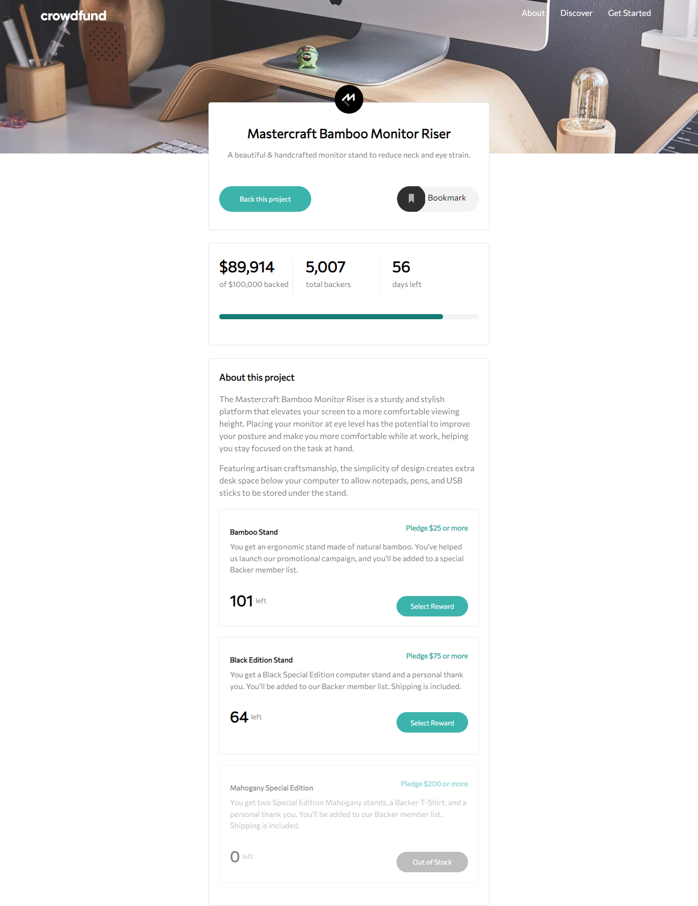
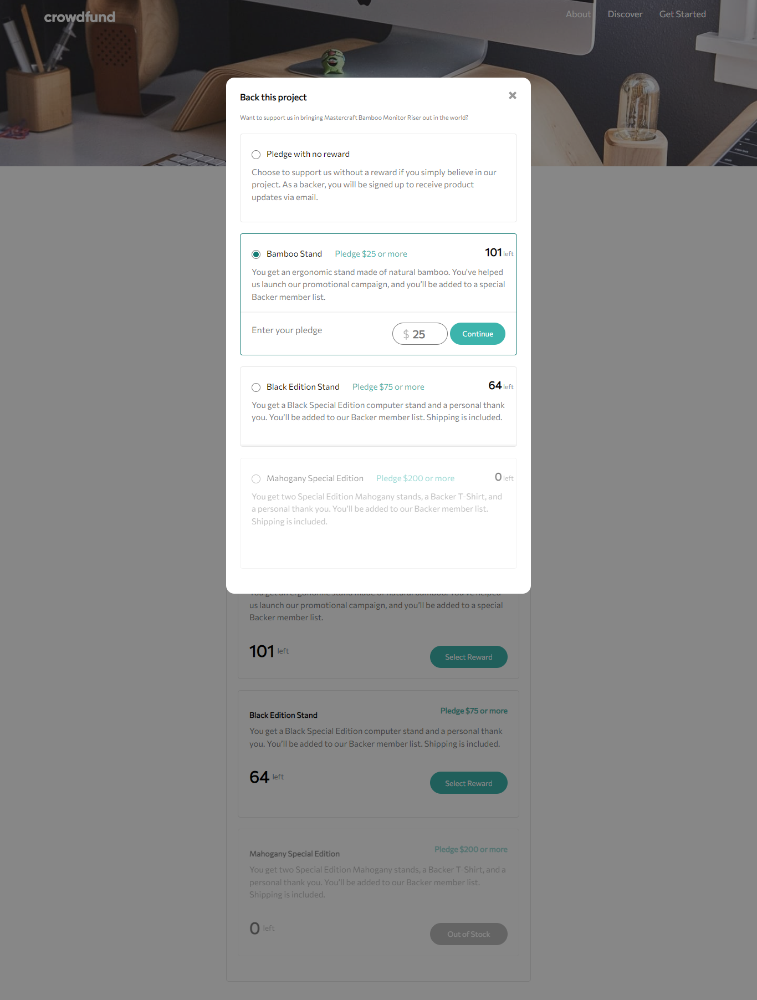
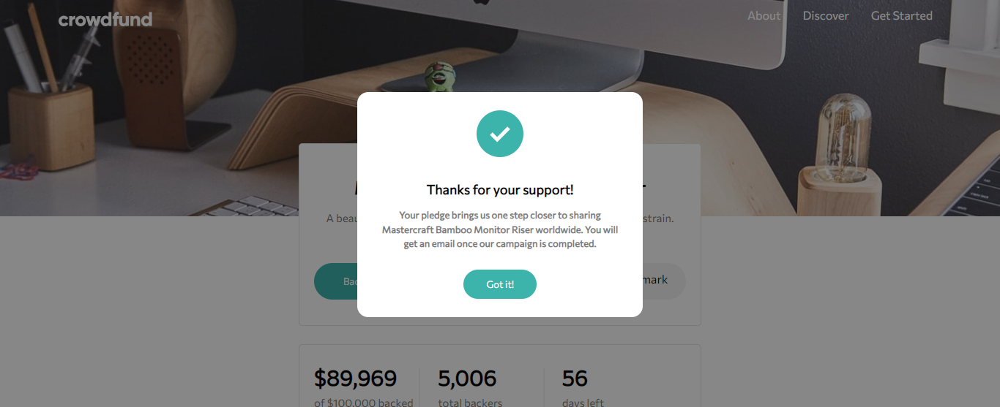

# Frontend Mentor - Crowdfunding product page solution

This is a solution to the [Crowdfunding product page challenge on Frontend Mentor](https://www.frontendmentor.io/challenges/crowdfunding-product-page-7uvcZe7ZR). Frontend Mentor challenges help you improve your coding skills by building realistic projects.

## Table of contents

- [Overview](#overview)
  - [The challenge](#the-challenge)
  - [Screenshot](#screenshot)
  - [Links](#links)
- [My process](#my-process)
  - [Built with](#built-with)
  - [What I learned](#what-i-learned)
- [Author](#author)

## Overview

### The challenge

Users should be able to:

- View the optimal layout depending on their device's screen size
- See hover states for interactive elements
- Make a selection of which pledge to make
- See an updated progress bar and total money raised based on their pledge total after confirming a pledge
- See the number of total backers increment by one after confirming a pledge
- Toggle whether or not the product is bookmarked

### Screenshot





### Links

- Live Site URL: [https://crowdfunding-product-page-swart.vercel.app/](https://crowdfunding-product-page-swart.vercel.app/)

## My process

### Built with

- Semantic HTML5 markup
- CSS custom properties
- Flexbox
- Mobile-first workflow
- Plain JavaScript

### What I learned

i learned how to fully manipulate the whole document with javascript, how to create custom progress bar with HTML and CSS, how to create modal with only HTML and CSS without any library or framework and how to create hamburger icon and animate it with only CSS and JS .
To see how you can add code snippets, see below:

```html
        <div class="progress-bar">
          <div class="empty"></div>
          <div class="fill"></div>
        </div>
```

```css
.progress-bar .empty {
  width: calc(100% - 200px);
  z-index: 1;
  background-color: var(--darkCyan);
}
```

```js
//scroll window to selected pledge
function scrollWindow(pledge) {
  window.scrollTo({
    top: pledge.getBoundingClientRect().top + window.scrollY,
    behavior: "smooth",
  });
}
```

## Author

- Frontend Mentor - [@mohamedhesham221](https://www.frontendmentor.io/profile/mohamedhesham221)
- Linkedin - [Muhammad Hisham](https://www.linkedin.com/in/muhammad-hisham-23544b253/)
